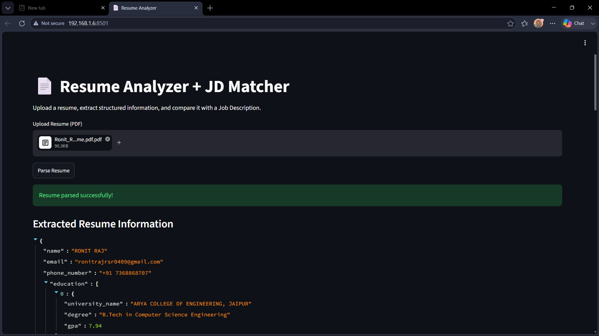
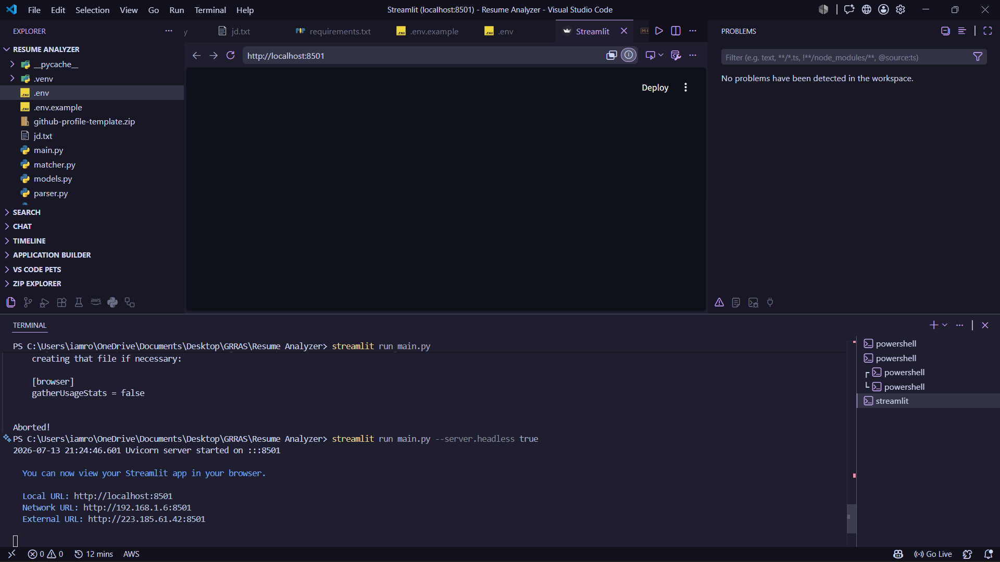

# 📄 Resume Analyzer & Job Description Matcher

<div align="center">


### 🚀 AI-Powered Resume Parser & Job Description Matcher

**Upload a Resume → Extract Structured Information → Compare with Job Description → Get ATS Match Score & Recruiter Insights**

---

</div>

# 📌 Overview

Resume Analyzer is an AI-powered web application that automatically extracts structured information from a resume PDF and compares it against a Job Description (JD).

Instead of manually reading resumes, this application leverages **Large Language Models (LLMs)** through **Groq + LangChain** to identify:

* Candidate Information
* Education
* Experience
* Skills
* ATS Match Score
* Missing Skills
* Recruiter Summary
* Strengths & Gaps

The project demonstrates practical usage of **Generative AI**, **Structured Output**, **Prompt Engineering**, and **Streamlit**.

---

# ✨ Features

## 📄 Resume Parsing

* Upload Resume PDF
* Extract Name
* Extract Email
* Extract Phone Number
* Extract Education
* Extract Experience
* Extract Technical Skills

---

## 🤖 AI Structured Extraction

Uses:

* LangChain
* Groq Llama Model
* Function Calling
* Pydantic Models

The AI returns structured JSON instead of plain text.

---

## 📊 Job Description Matching

Compare Resume with JD and generate:

* ATS Match Score
* Matched Skills
* Missing Skills
* Strengths
* Gaps
* Recruiter Summary

---

## 📥 Export Results

Download

* Parsed Resume JSON
* JD Match Result JSON

---

# 🧠 Project Workflow

```text
                Resume PDF
                     │
                     ▼
             PyPDFLoader
                     │
                     ▼
            Extract Resume Text
                     │
                     ▼
          LangChain PromptTemplate
                     │
                     ▼
          Groq Llama 3.3 LLM
                     │
                     ▼
     Structured Resume (Pydantic)
                     │
          Resume + Job Description
                     │
                     ▼
          AI Resume Matcher
                     │
                     ▼
      JDMatchResult (Structured)
                     │
                     ▼
             Streamlit Dashboard
```

---

# 🛠 Tech Stack

### Programming Language

* Python

### AI & LLM

* LangChain
* Groq LLM
* Prompt Engineering

### PDF Processing

* PyPDF
* PyPDFLoader

### Data Validation

* Pydantic

### Web Framework

* Streamlit

### Environment Management

* Python Dotenv

---

# 📂 Project Structure

```text
Resume-Analyzer/
│
├── .venv/
├── .env
├── requirements.txt
│
├── models.py
├── prompts.py
├── parser.py
├── matcher.py
├── main.py
│
├── resume.pdf
├── jd.txt
│
└── README.md
```

---

# ⚙ Installation

## Clone Repository

```bash
git clone https://github.com/Ronit049/Resume-Analyzer.git

cd Resume-Analyzer
```

---

## Create Virtual Environment

### Windows

```bash
python -m venv .venv
```

Activate

```bash
.venv\Scripts\activate
```

---

### Linux / macOS

```bash
python3 -m venv .venv

source .venv/bin/activate
```

---

## Install Dependencies

```bash
pip install -r requirements.txt
```

---

# 🔑 Environment Variables

Create a file named

```text
.env
```

Add your Groq API Key

```env
GROQ_API_KEY=your_groq_api_key
```

---

# ▶ Running the Project

Run Streamlit

```bash
streamlit run main.py
```

or

```bash
python -m streamlit run main.py
```

---

# 📖 How It Works

## Step 1

Upload Resume PDF

↓

## Step 2

PDF is converted into plain text

↓

## Step 3

Prompt is generated using LangChain

↓

## Step 4

Groq LLM extracts structured information

↓

## Step 5

Resume object is created using Pydantic

↓

## Step 6

User pastes Job Description

↓

## Step 7

LLM compares Resume & JD

↓

## Step 8

Generate

* Match Score
* Missing Skills
* Recruiter Summary

↓

## Step 9

Display results in Streamlit

---

# 📊 Example Output

## Parsed Resume

```json
{
  "name": "John Doe",
  "email": "john@gmail.com",
  "phone_number": "9876543210",
  "skills": [
    "Python",
    "SQL",
    "LangChain"
  ]
}
```

---

## JD Match Result

```json
{
  "match_score": 87,
  "matched_skills": [
    "Python",
    "SQL"
  ],
  "missing_skills": [
    "Docker",
    "FastAPI"
  ],
  "summary": "Candidate is a strong fit for the role."
}
```

---

# 📸 Application Preview

```text
📄 Upload Resume

⬇

🤖 Parse Resume

⬇

📋 View Structured Resume

⬇

📝 Paste Job Description

⬇

📊 Generate Match Score

⬇

📥 Download JSON Report
```

---
# 📸 Application Preview

## 🌐 Frontend Interface

<p align="center">
  
</p>

---

## 💻 Code Overview

<p align="center">
  
</p>

---
---
# 🎯 Learning Outcomes

This project demonstrates:

* Prompt Engineering
* Structured Output
* Function Calling
* LangChain Chains
* Groq Integration
* Resume Parsing
* ATS Resume Matching
* Streamlit Development
* Pydantic Models
* Environment Variables
* PDF Processing
* AI Application Development

---

# 🚀 Future Improvements

* Support DOCX resumes
* OCR for scanned PDFs
* Multi-resume ranking
* Resume improvement suggestions
* Skill gap visualization
* ATS compatibility analysis
* Company-specific scoring
* Cover Letter Generator
* Interview Question Generator
* LinkedIn Profile Analysis

---

# 🤝 Contributing

Contributions are welcome!

1. Fork the repository
2. Create a feature branch
3. Commit your changes
4. Push your branch
5. Open a Pull Request

---

# ⭐ Support

If you found this project helpful:

⭐ Star the repository

🍴 Fork it

📢 Share it with others

---

# 👨‍💻 Author

**Ronit Raj**

Computer Science Engineering Student

Passionate about

* Artificial Intelligence
* Agentic AI
* Machine Learning
* Python Development
* LangChain
* Generative AI
* Open Source

GitHub: https://github.com/Ronit049

LinkedIn: https://www.linkedin.com/in/ronit-raj/

---

# 📄 License

This project is licensed under the MIT License.

Feel free to use, modify, and distribute this project for educational and personal purposes.

---

<div align="center">

### ⭐ If you like this project, don't forget to give it a Star! ⭐

**Made with ❤️ using Python, LangChain, Groq & Streamlit**

</div>
